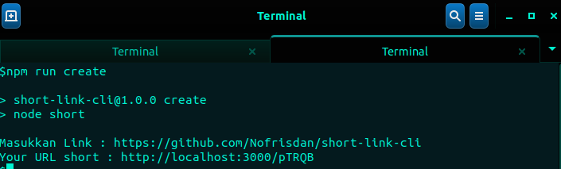
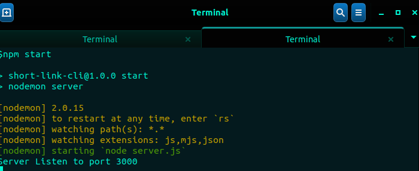
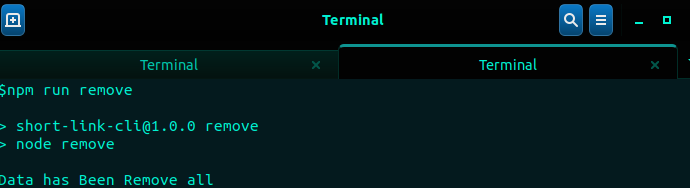

# Pengertian Aplikasi

<P>Aplikasi short-link-cli, merupakan salah satu aplikasi yang berfungsi untuk menyederhanakan link yang panjang menjadi link yang pendek</p>

## Cara Instalasi

<p>Clone Github</p>

```
git clone https://github.com/Nofrisdan/short-link-cli.git

```

## Cara Penggunaan Aplikasi

<p>1. Masuk Ke Directory Aplikasi</p>

```
cd short-link-cli

```

<p>2. Membuat Short Link </p>

```
npm run create

```



<p>3. Menjalankan Server</p>

```
npm start

```




<p>4. Menghapus semua link yang dibuat</p>

```
npm run remove

```


